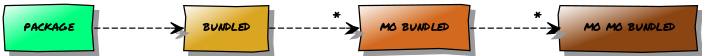

Background
==========

Over the years various packages that I maintain have begun to sprout incessant
duplication, and duplication is a *Bad Thing*\ ™.  Accepting duplication is the
start of a rabbit hole that leads to indefinite chasing of repeating bugs in
their copy’n’paste hideaways, and it needs to stop.

..
    graph [rankdir=LR]
    node [fontname="Permanent Marker", shape=box, style=filled]
    edge [fontname="Permanent Marker", arrowhead=empty, label="0…*"]

    "package" [fillcolor="#28ff1e"]
    "bundled" [fillcolor="#daa520"]
    "mo’ bundled" [fillcolor="#d2691e"]
    "mo’ mo’ bundled" [fillcolor="#8b4513"]

    "package" -> "bundled" -> "mo’ bundled" -> "mo’ mo’ bundled"

For an example of how bad it can get in the real world :download:`take a look
at pip <pip.dot>`; a package which bundles packages that themself bundle
packages, until the final turtle lets out a futile little yelp, squishes unto
itself and dies.

This package is my attempt at solving the problem for the projects I maintain,
and in its current state is an odd grab-bag of assorted functionality.  Whether
any of pieces will eventually deserve their own packages is yet to be decided,
but for now they’re destined to reside in |modref|.

Philosophy
----------

Scope
'''''

If a chunk of code is used in two or more of my other projects, it will either
be broken out in to its own package or placed here.  The choice of which will
depend mostly on size, but also on how self-contained it can be.

Design considerations
'''''''''''''''''''''

None of the code in this repository should change the behaviour of *anything*
unless it is explicitly enabled.

``pip`` dependency handling
'''''''''''''''''''''''''''

For a long time setuptools_ and pip_ claimed to support optional dependencies,
but the functionality wasn’t all that er… functional.  Recent versions of both
have improved the situation somewhat, so packaging up assorted modules like this
without forcing the installation of the dependencies for the unused
functionality is an option.

The ``extra`` directory contains a collection of pip_-compatible requirements
files for the optional functionality.  And you can use ``dep[extras]`` syntax
for specifying dependencies with ``setuptools``, if you also need to support
that too.

.. _pip: http://www.pip-installer.org/
.. _setuptools: https://pypi.org/project/setuptools/
